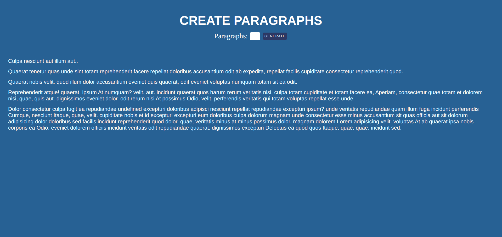

# LOREM PROJECT

## FULLSTACK PRACTICE PROJECT NO: 13

1. A fullstack version of my previous frontend project to practice my skills using Javascript, Jquery, NodeJS, ExpressJS, HTML, CSS.

2. When you enter a number between 1 to 100 and click button or press enter, it will create a new paragraph with equal length of words of your input.
